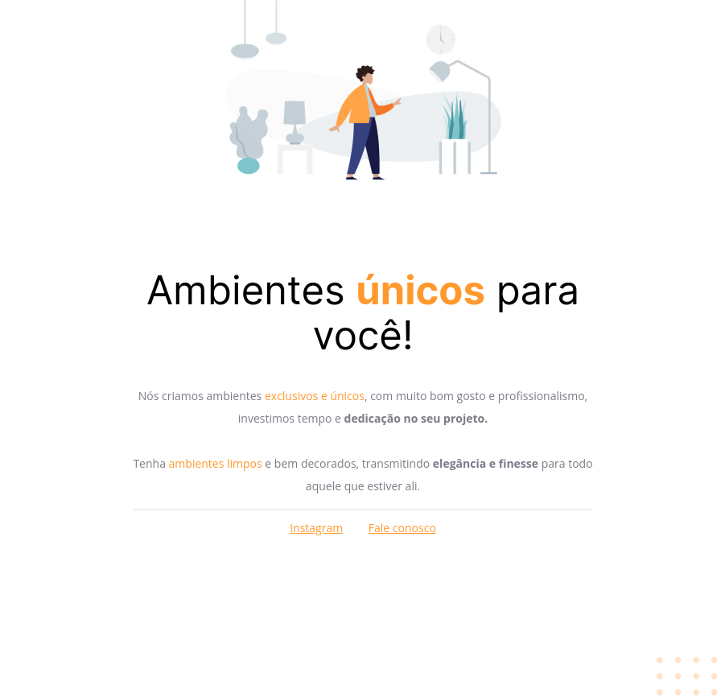

# 🖥️ Sobre o desafio

Nesse desafio, você receberá um código com o projeto desenvolvido durante as aulas da Fase 01.
Mas, a surpresa vem aí... 👀
O código sofreu algumas alterações e, como podemos ver na imagem abaixo, ele não está mais da mesma forma que o Maykão deixou.

---

# 📄 Layout Desafio

      

# 📄 Layout Desafio Finalizado

      

